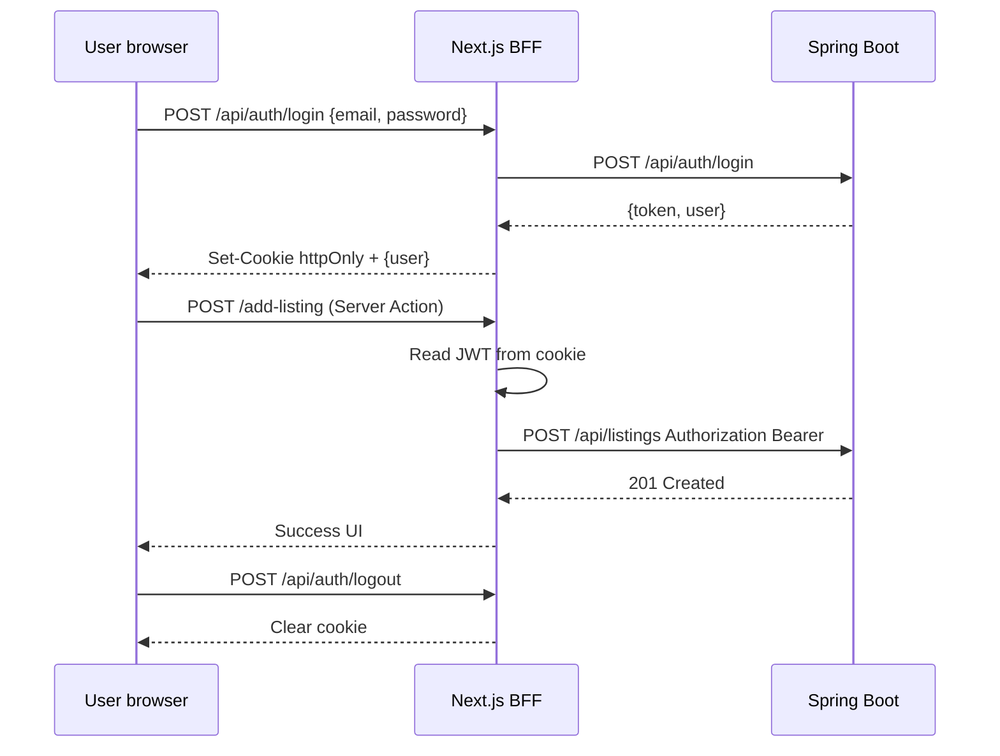

# Next.js Frontend — Spring Boot Authentication Integration Plan

**Status:** Planning only — no auth implementation in this document.  
**Backend source of truth:** `backend/src/main/java/com/wubebereha/api/`  
**API reference:** `docs/API_CONTRACT.md`  
**Date:** 2026-07-18

---

## 1. Executive summary

The Wube Bereha backend uses **stateless JWT bearer authentication**. Tokens are issued by `POST /api/auth/login` and `POST /api/auth/register`, validated on each request by `JwtAuthenticationFilter`, and sent via:

```http
Authorization: Bearer <token>
```

There is **no server session**, **no refresh endpoint**, **no logout endpoint**, and **no password-reset flow**. CSRF protection is **disabled**. CORS is enabled in Spring Security (`Customizer.withDefaults()`) but **no explicit allowed-origins configuration exists in the repository**.

The **safest frontend integration compatible with the current backend** is a **Next.js BFF (Backend-for-Frontend) pattern**:

1. Browser talks only to the Next.js app (same origin).
2. Next.js Route Handlers / Server Actions exchange credentials with Spring Boot and store the JWT in an **`httpOnly`, `Secure`, `SameSite` cookie**.
3. Server-side API clients read the cookie and attach `Authorization: Bearer …` when calling Spring Boot.
4. Client Components never read or write the raw JWT.

This avoids `localStorage` (XSS-exposed), avoids cross-origin browser calls to Spring Boot for authenticated mutations, and requires **no backend auth protocol changes** beyond optional CORS hardening if any direct browser→API calls remain.

The provisional `frontend/src/lib/auth/access-token.ts` (`localStorage`) used by `/add-listing` and `/submit-event` should be **replaced** during implementation — it is a convenience stub, not an endorsed architecture.

---

## 2. Backend authentication model (as implemented)

### 2.1 Components

| Component | Location | Responsibility |
|-----------|----------|----------------|
| `SecurityConfig` | `config/SecurityConfig.java` | Stateless sessions, CSRF off, URL authorization, CORS defaults |
| `JwtAuthenticationFilter` | `security/JwtAuthenticationFilter.java` | Parse `Authorization: Bearer`, populate `SecurityContext` |
| `JwtService` | `security/JwtService.java` | HS256 sign/verify; claims: `id`, `email`, `phone`, `role` |
| `AuthController` | `web/controller/AuthController.java` | `register`, `login`, `me` |
| `AuthService` | `service/AuthService.java` | Credential validation, BCrypt, token issuance |
| `SecurityUtils` | `security/SecurityUtils.java` | `currentUser()`, `requireAdmin()` |

### 2.2 Token type

| Property | Value |
|----------|-------|
| Type | **JWT** (JJWT, HS256) |
| Transport | **`Authorization: Bearer`** header |
| Storage (backend) | **None** — stateless |
| Secret | `wubebereha.jwt-secret` / env `JWT_SECRET` |
| Expiration | **Not set** in `JwtService.createToken()` — tokens have **no `exp` claim** and do not expire by default |
| Revocation | **Not supported** — invalid/expired tokens are ignored; valid tokens work until secret rotation |

### 2.3 JWT claims

| Claim | Type | Notes |
|-------|------|-------|
| `id` | number | User ID |
| `email` | string | May be null |
| `phone` | string | Normalized phone |
| `role` | string | `user` or `admin` |

Spring Security authorities: `ROLE_user` or `ROLE_admin` (`AuthUser.getAuthorities()`).

### 2.4 Roles

| Role | JWT `role` | Spring authority | Capabilities |
|------|------------|------------------|--------------|
| User | `user` | `ROLE_user` | Create listings/events, view own listings, optional-auth reads |
| Admin | `admin` | `ROLE_admin` | All user capabilities + `/api/admin/**` |

Role is assigned at registration (`User.role` defaults to `user`). No role-elevation API exists.

---

## 3. Auth endpoints

### 3.1 `POST /api/auth/register`

| | |
|---|---|
| Auth | None (public) |
| Status | `201 Created` |

**Request body (`AuthRequest`):**

```json
{
  "email": "user@example.com",
  "phone": "+15551234567",
  "phone_country": "US",
  "password": "secret123"
}
```

| Field | Required | Notes |
|-------|----------|-------|
| `email` | One of email or phone | |
| `phone` | One of email or phone | Normalized server-side |
| `phone_country` | No | Default `US` |
| `password` | Yes | Min 6 characters |

**Response (`AuthResponse`):**

```json
{
  "token": "<jwt>",
  "user": {
    "id": 2,
    "email": "user@example.com",
    "phone": null,
    "phone_country": "US",
    "role": "user"
  }
}
```

**Errors:** `400` validation, `409` duplicate account.

### 3.2 `POST /api/auth/login`

| | |
|---|---|
| Auth | None (public) |
| Status | `200 OK` |

Same request/response shape as register. Login accepts email **or** phone + password.

**Errors:** `400` validation, `401` `Invalid credentials`.

### 3.3 `GET /api/auth/me`

| | |
|---|---|
| Auth | **Required** Bearer JWT |
| Status | `200 OK` |

**Response (`MeResponse`):**

```json
{
  "user": { /* UserResponse */ }
}
```

**Errors:** `401` `Authentication required`, `404` `User not found`.

Use on the frontend to **hydrate session state** after cookie-based login and on app load.

### 3.4 Logout — **MISSING**

No `POST /api/auth/logout`. JWT is stateless; logout is **client/BFF-side only** (delete cookie / clear in-memory state). Existing tokens remain valid until secret rotation.

### 3.5 Refresh — **MISSING**

No `POST /api/auth/refresh`. With non-expiring JWTs, sessions persist indefinitely. **Future backend work** should add `exp` + refresh tokens before production.

### 3.6 Password reset — **MISSING**

No forgot-password, reset-token, or change-password endpoints. Frontend should **not** build a reset UI until backend endpoints exist. Interim UX: link to support/contact or admin-assisted recovery.

---

## 4. Protected endpoints

Authorization is defined in `SecurityConfig.securityFilterChain()`.

### 4.1 Public (no token required)

| Method | Path |
|--------|------|
| `GET` | `/health`, `/metrics`, `/actuator/**` |
| `POST` | `/api/auth/register`, `/api/auth/login` |
| `GET` | `/api/listings`, `/api/listings/`, `/api/listings/categories`, `/api/listings/states` |
| `GET` | `/api/listings/{listingId}` |
| `GET` | `/api/events`, `/api/events/` |
| `GET` | `/api/advertise/tiers` |
| `POST` | `/api/advertise/inquiry` |
| `GET` | `/uploads/**` |

### 4.2 Optional authentication (public, enriched when token present)

These routes are `permitAll`, but `JwtAuthenticationFilter` still parses a Bearer token if sent:

| Method | Path | Auth-gated behavior |
|--------|------|---------------------|
| `GET` | `/api/listings` | `contact_email`, `contact_phone` only when authenticated |
| `GET` | `/api/listings/{listingId}` | Pending listings visible to owner/admin; contact fields when authenticated |
| `GET` | `/api/events` | Contact fields when authenticated |

Invalid tokens are **silently ignored** (request continues unauthenticated).

### 4.3 Authentication required (any `user` or `admin`)

| Method | Path | Notes |
|--------|------|-------|
| `GET` | `/api/auth/me` | Current user profile |
| `GET` | `/api/listings/my` | Organizer's listings |
| `POST` | `/api/listings` | Create listing (JSON or multipart) |
| `GET` | `/api/events/states` | **Not** in `permitAll` — returns `403` without token |
| `POST` | `/api/events` | Create event |
| * | *any other unmatched route* | `.anyRequest().authenticated()` |

### 4.4 Admin only (`ROLE_admin`)

| Method | Path |
|--------|------|
| `GET` | `/api/admin/pending` |
| `POST` | `/api/admin/{listingId}/approve` |
| `POST` | `/api/admin/{listingId}/reject` |
| `GET` | `/api/admin/ad-inquiries` |

Non-admin authenticated users receive **`403 Forbidden`** from Spring Security.

---

## 5. CSRF requirements

| Setting | Backend value | Frontend implication |
|---------|---------------|---------------------|
| CSRF | **Disabled** (`csrf(AbstractHttpConfigurer::disable)`) | No CSRF token required for API calls |
| Session | **STATELESS** | No session cookie from Spring Boot |

**Recommendation:** Do **not** rely on CSRF absence as a long-term security control. The BFF cookie pattern should use `SameSite=Lax` (or `Strict` where UX allows) to reduce cross-site request risk. If the backend later enables CSRF for cookie-based auth, the BFF must forward CSRF tokens — not applicable today.

---

## 6. CORS requirements

### 6.1 Current backend state

- `SecurityConfig` calls `.cors(Customizer.withDefaults())`.
- **No** `CorsConfigurationSource` bean, `@CrossOrigin`, or `spring.web.cors.*` properties exist in the repo.
- Default Spring Boot CORS behavior may **block** browser `fetch` from `http://localhost:3000` → `http://localhost:8080` for non-simple requests.

### 6.2 Frontend deployment scenarios

| Pattern | CORS needed? | Notes |
|---------|--------------|-------|
| **BFF (recommended)** — browser → Next.js only | **No** for auth/mutations | Next.js server calls Spring Boot server-to-server |
| **Direct browser → Spring Boot** | **Yes** | Must add explicit allowed origins, methods, headers |
| Server Components / SSR `fetch` | **No** | Server-side calls are not CORS-constrained |

### 6.3 If direct browser calls are kept (not recommended)

Backend would need (future change, out of scope for frontend-only work):

```yaml
# Example — not currently in application.yml
spring.web.cors:
  allowed-origins: ["https://wubebereha.com", "http://localhost:3000"]
  allowed-methods: [GET, POST, PUT, PATCH, DELETE, OPTIONS]
  allowed-headers: [Authorization, Content-Type]
  allow-credentials: false  # Bearer in header, not cookies from Spring
```

With **BFF + httpOnly cookie**, the browser never sends cross-origin authenticated requests to Spring Boot, minimizing CORS exposure.

---

## 7. Recommended Next.js integration architecture

### 7.1 Target architecture (safest, no backend changes)

```
┌─────────────┐     same-origin      ┌──────────────────┐   server-to-server   ┌─────────────┐
│   Browser   │ ──────────────────► │  Next.js (BFF)   │ ──────────────────► │ Spring Boot │
│             │   cookie: session   │  Route Handlers  │  Authorization:     │             │
│             │   (httpOnly JWT)    │  Server Actions  │  Bearer <jwt>       │             │
└─────────────┘                     └──────────────────┘                     └─────────────┘
```

### 7.2 Cookie contract (proposed)

| Property | Value |
|----------|-------|
| Name | `wubebereha.session` (or `__Host-wubebereha.session` in production) |
| Value | Raw JWT from `AuthResponse.token` |
| `httpOnly` | `true` — **not accessible to JavaScript** |
| `Secure` | `true` in production |
| `SameSite` | `Lax` (login/register POST + navigation) |
| `Path` | `/` |
| `Max-Age` | Align with future backend `exp`; until then, reasonable session TTL (e.g. 7 days) set by BFF |

### 7.3 Proposed Next.js routes (implementation phase)

| Route | Method | Action |
|-------|--------|--------|
| `/api/auth/login` | `POST` | Proxy to Spring `POST /api/auth/login`, set cookie |
| `/api/auth/register` | `POST` | Proxy to Spring `POST /api/auth/register`, set cookie |
| `/api/auth/logout` | `POST` | Clear cookie (no backend call) |
| `/api/auth/session` | `GET` | Read cookie → `GET /api/auth/me` → return user to client |

Client-visible session state: **`user` object only** (from `/api/auth/session`), never the raw token.

### 7.4 API client changes (implementation phase)

| Client | Token source | Use case |
|--------|--------------|----------|
| `createServerApiClient({ accessToken })` | Cookie read in Server Component / Route Handler | SSR, RSC, server actions |
| `createBrowserApiClient()` | **No token** — call `/api/auth/*` BFF or Server Actions | Client Components |
| Authenticated mutations from Client Components | Server Action or BFF proxy | `/add-listing`, `/submit-event` |

Existing `frontend/src/lib/api/request.ts` already supports `accessToken` injection — wire it from the cookie on the server.

### 7.5 UI routes (implementation phase)

| Page | Purpose |
|------|---------|
| `/login` | Email/phone + password → BFF login |
| `/register` | Registration → BFF register |
| `/logout` | Optional; or header button POSTing to BFF logout |

Support `?next=` redirect (already referenced by submission forms).

### 7.6 Middleware (implementation phase)

Next.js `middleware.ts`:

- Read session cookie presence (not JWT parsing in Edge unless using compatible library).
- Redirect unauthenticated users from protected pages (e.g. `/add-listing`, `/submit-event`, future `/admin`).
- Optional: call lightweight session check.

**Note:** Public pages remain public; only gate write flows and admin.

---

## 8. Token storage comparison

| Approach | XSS risk | CSRF risk | Works with current backend | Recommendation |
|----------|----------|-----------|---------------------------|----------------|
| **`localStorage` + Bearer** (current stub) | **High** — any script can exfiltrate | Low | Yes | **Do not use** |
| **Memory-only** | Lower while tab open | Low | Yes | OK for SPA prototypes; lost on refresh |
| **httpOnly cookie + BFF** | **Low** — JS cannot read | Medium (mitigate with SameSite) | Yes (BFF adds Bearer) | **Recommended** |
| **httpOnly cookie on Spring Boot** | Low | Medium | **Requires backend changes** | Future option |

### 8.1 `localStorage` policy for this project

> **Do not store JWTs in `localStorage`.**  
> The existing `frontend/src/lib/auth/access-token.ts` is provisional scaffolding for unauthenticated submission forms. It must be removed when auth is implemented.

If a future requirement forces client-side token access (e.g. third-party WebSocket), document the XSS tradeoff explicitly and prefer short-lived tokens + refresh — neither exists today.

---

## 9. Session lifecycle



| Event | Behavior |
|-------|----------|
| Login / register | BFF stores JWT in httpOnly cookie; return `user` to UI |
| Authenticated API call | Server reads cookie → attaches Bearer header |
| Page load | `GET /api/auth/session` → Spring `GET /api/auth/me` |
| Logout | Delete cookie; optionally clear React Query cache |
| Token invalid | `401` from Spring → BFF clears cookie → redirect to `/login` |
| Refresh | **Not available** — user must re-login after cookie expiry (once BFF sets Max-Age) or indefinitely today |

---

## 10. Error handling

| HTTP status | Backend message (examples) | Frontend action |
|-------------|---------------------------|-----------------|
| `400` | Validation strings | Field-level form errors |
| `401` | `Invalid credentials`, `Authentication required` | Login form error or redirect to `/login` |
| `403` | Spring Security denial | Show forbidden; hide admin UI for non-admins |
| `409` | `Account already exists…` | Registration form error |

Error body shape: `{ "error": "message" }` (`ErrorResponse`).

---

## 11. Frontend files affected (implementation phase — not done now)

| File | Change |
|------|--------|
| `lib/auth/access-token.ts` | **Remove** or restrict to server-only cookie reader |
| `lib/api/browser.ts` | Stop reading tokens from browser storage |
| `lib/api/server.ts` | Add `getServerAccessToken()` from cookies |
| `app/api/auth/*` | New Route Handlers |
| `middleware.ts` | New — route protection |
| `app/login/page.tsx`, `app/register/page.tsx` | New pages |
| `components/listings/add-listing-form.tsx` | Use Server Action instead of `getAccessToken()` |
| `components/events/submit-event-form.tsx` | Same |

---

## 12. Security gaps & future backend work

These are **not blockers for the BFF plan** but should be tracked:

| Gap | Risk | Suggested backend follow-up |
|-----|------|----------------------------|
| JWT has no `exp` | Stolen tokens valid forever | Add expiration + refresh endpoint |
| No logout / revocation | Cannot invalidate sessions | Token denylist or short TTL + refresh |
| No password reset | Account recovery manual | `POST /api/auth/password-reset` flow |
| CORS not configured | Direct browser API calls fail or are overly permissive by default | Explicit `CorsConfigurationSource` |
| `GET /api/events/states` requires auth | Inconsistent with `GET /api/listings/states` | Consider `permitAll` or document |
| Admin role seed-only | No self-service promotion | Operational process only |

---

## 13. Implementation checklist (ordered)

1. **Add BFF auth routes** (`login`, `register`, `logout`, `session`) with httpOnly cookie.
2. **Add `getServerSession()`** utility wrapping cookie + `GET /api/auth/me`.
3. **Replace `localStorage` token usage** in submission forms with Server Actions.
4. **Add `/login` and `/register` pages** with React Hook Form + Zod (reuse `AuthRequest` types).
5. **Add middleware** protecting `/add-listing`, `/submit-event`, future `/admin`.
6. **Update nav** — show Sign In / Sign Out based on session.
7. **Document env vars** — `NEXT_PUBLIC_API_BASE_URL` for server-side Spring Boot URL only.
8. **Verify CORS** — confirm no client-side direct calls to Spring Boot for authenticated routes.
9. **Add integration tests** for BFF routes (mock Spring Boot).
10. **Plan backend hardening** — JWT expiration, refresh, password reset (separate tickets).

---

## 14. Environment variables

| Variable | Consumer | Purpose |
|----------|----------|---------|
| `NEXT_PUBLIC_API_BASE_URL` | Next.js server `fetch` | Spring Boot base URL |
| `NEXT_PUBLIC_SITE_URL` | Metadata, redirects | Canonical site origin |
| `JWT_SECRET` | **Backend only** | Never expose to Next.js client bundle |

Cookie signing secret (if using encrypted session cookies instead of raw JWT) would be **server-only** env on Next.js — optional enhancement; raw JWT in httpOnly cookie is sufficient for phase 1.

---

## 15. References

| Resource | Path |
|----------|------|
| Security filter chain | `backend/.../config/SecurityConfig.java` |
| JWT filter | `backend/.../security/JwtAuthenticationFilter.java` |
| JWT service | `backend/.../security/JwtService.java` |
| Auth controller | `backend/.../web/controller/AuthController.java` |
| Auth service | `backend/.../service/AuthService.java` |
| API contract | `docs/API_CONTRACT.md` |
| Frontend server client | `frontend/src/lib/api/server.ts` |
| Provisional token stub (to replace) | `frontend/src/lib/auth/access-token.ts` |
